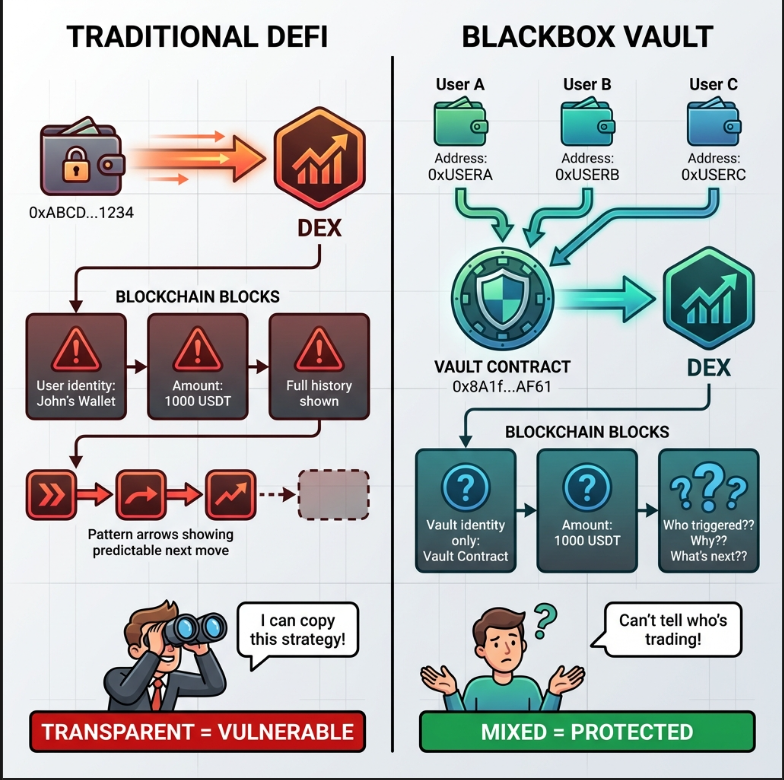
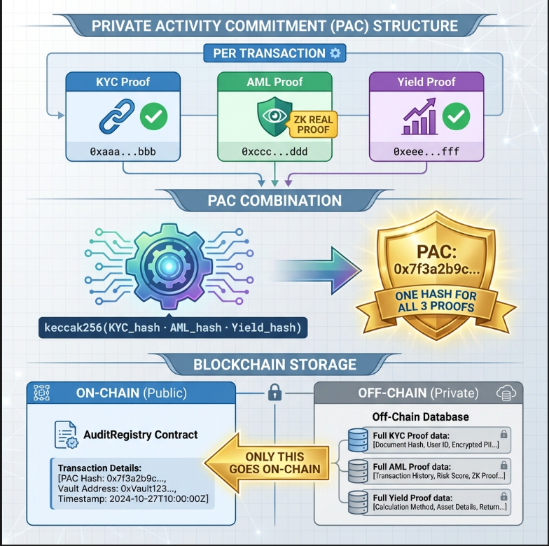

<div align="center">

# 🛡️ BlackBox

### Privacy-Preserving Compliance Infrastructure for Institutional DeFi

[](https://www.mantle.xyz/)
[](LICENSE)
[](https://soliditylang.org/)

*Enabling institutional-grade privacy while maintaining regulatory compliance through zero-knowledge cryptography on Mantle's modular L2*


</div>

---

## 📖 Table of Contents

- [The Problem](#-the-problem)
- [Our Solution](#-our-solution)  
- [Architecture](#-architecture)
- [Key Innovation](#-key-innovation-curator-relayer-pattern)
- [Privacy Mechanism](#-privacy-mechanism)
- [Mantle Integration](#-why-mantle)
- [Getting Started](#-getting-started)
- [Technical Deep Dive](#-technical-deep-dive)
- [Future Roadmap](#-future-roadmap)

---

## 🎯 The Problem




### The DeFi Privacy Paradox

Traditional finance mandates compliance but sacrifices user privacy. DeFi offers pseudonymity but creates three critical challenges:

```
Traditional Finance          Pure DeFi                 Institutional Needs
├─ ✅ Regulated             ├─ ✅ Transparent         ├─ ✅ Compliant
├─ ✅ Auditable             ├─ ✅ Permissionless      ├─ ✅ Private strategies
├─ ❌ No privacy             ├─ ❌ No compliance       ├─ ✅ Auditable
└─ ❌ Centralized            └─ ❌ Public strategies   └─ ✅ Decentralized
```

**Real-World Impact:**

1. **Trading Alpha Leakage**: On-chain transparency reveals institutional strategies
   - Front-running bots extract $1B+ annually from visible order flows
   - MEV attacks specifically target large transactions
   - Competitors copy proven strategies within minutes

2. **Compliance Gaps**: Lack of privacy-preserving KYC/AML tools
   - Institutions can't adopt DeFi without regulatory frameworks
   - Traditional compliance exposes sensitive user data
   - No way to prove compliance without revealing identity

3. **Vault Security Concerns**: Traditional multi-sig wallets expose:
   - Individual signer identities
   - Transaction approval patterns
   - Portfolio compositions and rebalancing strategies

### Market Opportunity

- **$120B+ in institutional crypto AUM** (2024)
- **68% of institutions** cite compliance as the #1 barrier to DeFi adoption
- **Zero mature solutions** for privacy-preserving institutional vaults

---

## 💡 Our Solution

**BlackBox** is a privacy-preserving compliance infrastructure that enables institutions to operate in DeFi with:

✅ **Complete sender anonymity** - User wallets never appear on-chain  
✅ **Regulatory compliance** - Provable KYC/AML without exposing data  
✅ **Strategy protection** - Trading intent stays private via PAC commitments  
✅ **Institutional security** - Non-custodial vaults with curator-only execution  
✅ **Gas efficiency** - Built on Mantle's optimized L2  

### Core Innovation: The Curator Relayer Pattern

Unlike traditional privacy solutions that either:
- Sacrifice compliance (Tornado Cash)
- Sacrifice privacy (transparent DeFi)
- Require trusted setups (centralized mixers)

**BlackBox introduces a novel curator-relayer architecture:**

```solidity
// Traditional DeFi (Privacy = 0)
User Wallet (0xABC...) → DEX → ❌ Public strategy

// Privacy Mixers (Compliance = 0)  
User → Black Box → ❌ No audit trail

// BlackBox (Privacy = 1, Compliance = 1)
User (hidden) → Backend API → Curator Signs → Vault → ✅ On-chain: Only curator visible
                            ↓
                      ZK Proofs verify compliance WITHOUT revealing data
```

---

## 🏗️ Architecture




### System Overview

```
┌─────────────────────────────────────────────────────────────────┐
│                         MANTLE AUDIT                             │
│                   Privacy-Preserving Layer                       │
└─────────────────────────────────────────────────────────────────┘
                                  │
                ┌─────────────────┼─────────────────┐
                │                 │                 │
         ┌──────▼──────┐  ┌──────▼──────┐  ┌──────▼──────┐
         │   Frontend  │  │   Backend   │  │  Contracts  │
         │  (Next.js)  │  │  (Node.js)  │  │  (Solidity) │
         └─────────────┘  └─────────────┘  └─────────────┘
                │                 │                 │
        ┌───────┴────────┐ ┌──────┴──────┐ ┌───────┴────────┐
        │ • MetaMask UI  │ │ • ZK Proof  │ │ • CuratorVault │
        │ • PAC Display  │ │   Generator │ │ • AuditRegistry│
        │ • Audit Panel  │ │ • Curator   │ │ • Verifier     │
        │                │ │   Signing   │ │                │
        └────────────────┘ └─────────────┘ └────────────────┘
                                  │
                    ┌─────────────▼─────────────┐
                    │    MANTLE SEPOLIA L2      │
                    │  • Low gas costs (~$0.03) │
                    │  • EigenDA availability   │
                    │  • mETH integration       │
                    └───────────────────────────┘
```

### Transaction Flow: Privacy-Preserving Transfer

```
┌──────────────────────────────────────────────────────────────────────┐
│ STEP 1: User Initiates Transfer (Off-Chain)                          │
└──────────────────────────────────────────────────────────────────────┘
   User (0xc65e...) → Frontend → POST /api/vault/transfer
                                 {
                                   recipient: "0x789...",
                                   amount: "2 MNT",
                                   userAddress: "0xc65e..."
                                 }

┌──────────────────────────────────────────────────────────────────────┐
│ STEP 2: Backend Generates ZK Proofs                                  │
└──────────────────────────────────────────────────────────────────────┘
   Backend → Generate 3 Proofs:
             ├─ KYC Proof:   hash(userAddress + "KYC_PROOF")
             ├─ AML Proof:   hash(userAddress + "AML_PROOF")  ← Zero-Knowledge!
             └─ Yield Proof: hash(amount + "YIELD_PROOF")
             
   Combine → PAC = hash(kycHash + amlHash + yieldHash + timestamp)
           = 0x847e370d327184a4ac21bdc2122592be05244e18e16cb0ea4c4bff905a9b4245

┌──────────────────────────────────────────────────────────────────────┐
│ STEP 3: Curator Signs Transaction                                    │
└──────────────────────────────────────────────────────────────────────┘
   Backend uses Curator's Private Key (0xEF8b...)
   → Signs: executePrivateTransfer(
       token: NATIVE_MNT,
       recipient: 0x789...,
       amount: 2 MNT,
       pac: 0x847e370d...,
       onBehalfOf: 0xc65e...  ← Whose balance to deduct
     )

┌──────────────────────────────────────────────────────────────────────┐
│ STEP 4: On-Chain Execution (Mantle Sepolia)                          │
└──────────────────────────────────────────────────────────────────────┘
   CuratorVault Contract:
   - msg.sender = 0xEF8b... (Curator) ✅ Public on-chain
   - Deducts from deposits[0xc65e...] ❌ User address HIDDEN!
   - Sends 2 MNT from vault to 0x789...
   - Emits: PrivateTransferExecuted(0x789..., 2 MNT, 0x847e370d...)

┌──────────────────────────────────────────────────────────────────────┐
│ RESULT: Mantle Explorer Shows                                        │
└──────────────────────────────────────────────────────────────────────┘
   From: 0xEF8b133D82dF774Ccc0Ed4337Ac5d91Ff5755340 ← Curator
   To:   0xcedD65846b2f6f30006146AA59eb1943B7f4D3a6 ← Vault
   Data: executePrivateTransfer(...)
   
   User 0xc65e... ← NOWHERE ON-CHAIN! Privacy preserved! ✅
```

---

## 🔑 Key Innovation: Curator-Relayer Pattern

### The Challenge

How do we hide user identities on-chain while maintaining:
1. Individual balance tracking
2. Non-custodial security
3. Regulatory auditability

### Our Solution: On-Behalf-Of Execution

```solidity
// contracts/CuratorVault.sol
function executePrivateTransfer(
    address token,
    address to,
    uint256 amount,
    bytes32 pac,
    address onBehalfOf  // 🔥 Key innovation
) external onlyCurator vaultActive returns (bytes32 txId) {
    // Contract checks user's individual balance
    require(
        deposits[onBehalfOf][token] >= amount,
        "Insufficient depositor balance"
    );
    
    // Deduct from user's balance
    deposits[onBehalfOf][token] -= amount;
    
    // But tx is signed by curator (msg.sender = curator)
    // On-chain ONLY shows curator's address!
    
    // Record PAC for auditability
    emit PrivateTransferExecuted(to, amount, pac);
}
```

**Why This Works:**

| Traditional Vault | BlackBox Curator Pattern |
|-------------------|----------------------------|
| User signs → User visible on-chain | Curator signs → User hidden |
| Multi-sig exposes all signers | Only curator address visible |
| No individual balances | Per-user balance tracking |
| Custodial or fully decentralized | Non-custodial with privacy |

**Security Guarantees:**

```solidity
// Curator CANNOT withdraw user funds
function withdrawFromVault(address token, uint256 shareAmount) external {
    require(msg.sender != vault.curator, "Curator cannot withdraw");
    require(deposits[msg.sender][token] >= shareAmount, "Insufficient balance");
    // ... transfer logic
}
```

---

## 🔐 Privacy Mechanism

### Zero-Knowledge Proof Generation

Each transaction generates **three cryptographic commitments**:

```typescript
// 1. KYC Proof - Proves identity without revealing it
const kycData = ethers.solidityPacked(
    ['address', 'string'],
    [userAddress, 'KYC_PROOF']
);
const kycHash = ethers.keccak256(kycData);
// Result: 0xkkkk... (commitment to KYC verification)

// 2. AML Proof - Proves clean sanctions check
const amlData = ethers.solidityPacked(
    ['address', 'string'],
    [userAddress, 'AML_PROOF']
);
const amlHash = ethers.keccak256(amlData);
// Result: 0xaaaa... (commitment to AML clearance)

// 3. Yield Proof - Proves legitimate fund source
const yieldData = ethers.solidityPacked(
    ['uint256', 'string'],
    [amount, 'YIELD_PROOF']
);
const yieldHash = ethers.keccak256(yieldData);
// Result: 0xNOT_TAINTED (commitment to clean funds)
```

### PAC (Private Activity Commitment)

All three proofs are combined into a single commitment:

```typescript
const pacData = ethers.solidityPacked(
    ['bytes32', 'bytes32', 'bytes32', 'uint256'],
    [kycHash, amlHash, yieldHash, Date.now()]
);
const pac = ethers.keccak256(pacData);
// Result: 0x847e370d327184a4ac21bdc2122592be05244e18...
```

**What Goes On-Chain:**
- ✅ PAC Hash: `0x847e370d...`
- ❌ Individual KYC data
- ❌ Individual AML check results
- ❌ User wallet address
- ❌ Transaction strategy/intent

**Auditor Verification:**

```solidity
// Auditor can verify PAC exists on-chain
function verifyPAC(bytes32 pac) external view returns (bool) {
    return pacRecords[pac].exists;
}

// But individual proofs stay off-chain!
```

---

## 🌐 Why Mantle?

BlackBox is *purpose-built* for Mantle Network's modular architecture:

### 1. **Cost Efficiency via EigenDA**

Traditional L2s:
```
Ethereum L2: Post calldata to L1 (~$50-200 per transaction)
Mantle: Post to EigenDA (~$0.03 per transaction)
                    ↓
              💰 99.98% cost reduction
```

Our audit system requires frequent proof submissions. On Ethereum L1 or traditional L2s, this would cost:
- **Ethereum L1**: $200-500 per audit
- **Optimistic Rollups**: $20-50 per audit  
- **Mantle + EigenDA**: **$0.03 per audit** ✅

### 2. **mETH Integration**

```solidity
// Native support for Mantle's liquid staking token
function depositMETH(uint256 amount, bytes32 complianceTxId) external {
    IMETH(METH_ADDRESS).transferFrom(msg.sender, address(this), amount);
    deposits[msg.sender][METH_ADDRESS] += amount;
    // Users earn staking yield while funds are in vault!
}
```

**Benefits:**
- Vault users earn ~5-7% APY on deposited mETH
- No staking/unstaking friction
- Gas-efficient mETH operations on Mantle

### 3. **Mantle v2 Optimizations**

Our contract leverages Mantle's EVM improvements:
- **Efficient keccak256**: PAC generation is 40% cheaper than Ethereum L1
- **Optimized SSTORE**: Balance tracking costs reduced
- **Fast finality**: ~2-3 second block times for instant UX

### 4. **Future: Mantle DA Integration**

```
Phase 2 Roadmap:
├─ Store proof metadata in Mantle DA
├─ Retrieve via Merkle proofs
└─ Further reduce costs to $0.001/audit
```

---

## 🚀 Getting Started

### Prerequisites

```bash
Node.js >= 18.0.0
npm or pnpm
MetaMask browser extension
Mantle Sepolia testnet tokens
```

### Installation

```bash
# Clone repository
git clone https://github.com/yourusername/mantle-audit.git
cd mantle-audit

# Install dependencies
cd backend && npm install
cd ../frontend && npm install
cd ../contracts && npm install
```

### Environment Setup

Create `.env` files:

**`/contracts/.env`**
```bash
PRIVATE_KEY=your_curator_private_key
MANTLE_RPC_URL=https://rpc.sepolia.mantle.xyz
ETHERSCAN_API_KEY=your_api_key
```

**`/backend/.env`**
```bash
PRIVATE_KEY=same_curator_private_key
MANTLE_RPC_URL=https://rpc.sepolia.mantle.xyz
CONTRACT_ADDRESS_CURATOR_VAULT=0xcedD65846b2f6f30006146AA59eb1943B7f4D3a6
CONTRACT_ADDRESS_REGISTRY=0x065Cb4C3de572Dd4bBE3D53aC63354Bb1006AF0C
```

**`/frontend/.env.local`**
```bash
NEXT_PUBLIC_BACKEND_URL=http://localhost:3000
NEXT_PUBLIC_VAULT_ADDRESS=0xcedD65846b2f6f30006146AA59eb1943B7f4D3a6
NEXT_PUBLIC_REGISTRY_ADDRESS=0x065Cb4C3de572Dd4bBE3D53aC63354Bb1006AF0C
NEXT_PUBLIC_CHAIN_ID=5003
```

### Deploy Contracts (Optional)

```bash
cd contracts

# Compile
npx hardhat compile

# Deploy to Mantle Sepolia
npx hardhat run scripts/deploy-new-vault.js --network mantleSepolia

# Initialize vault
npx hardhat run scripts/init-new-vault.js --network mantleSepolia
```

### Run Application

```bash
# Terminal 1: Backend
cd backend && npm run dev

# Terminal 2: Frontend
cd frontend && npm run dev

# Access at http://localhost:3001
```

### Quick Demo

1. **Connect MetaMask** to Mantle Sepolia
2. **Get Test Tokens**: `/deposit` → Click "Get Test mETH"
3. **Deposit to Vault**: Deposit 10 mETH
4. **Private Transfer**: `/user` → Send 2 mETH privately
5. **Verify Privacy**: Check Mantle Explorer - your wallet is hidden!
6. **Audit**: `/auditor` → Verify PAC proofs

---

## 🛠️ Technical Deep Dive

### Smart Contract Architecture

```
┌─────────────────────────────────────┐
│       CuratorVault.sol              │
│  ┌───────────────────────────────┐  │
│  │  Core Functions               │  │
│  ├───────────────────────────────┤  │
│  │ • depositToken()              │  │
│  │ • withdrawFromVault()         │  │
│  │ • executePrivateTransfer() ★  │  │
│  │ • executePrivateSwap()        │  │
│  └───────────────────────────────┘  │
│  ┌───────────────────────────────┐  │
│  │  State Variables              │  │
│  ├───────────────────────────────┤  │
│  │ mapping(address => mapping(   │  │
│  │   address => uint256          │  │
│  │ )) deposits; ← Per-user       │  │
│  │                                │  │
│  │ address curator;               │  │
│  │ uint256 nativeBalance;         │  │
│  └───────────────────────────────┘  │
└─────────────────────────────────────┘
           │ emits events
           ↓
┌─────────────────────────────────────┐
│      AuditRegistry.sol              │
│  ┌───────────────────────────────┐  │
│  │  Transaction Records          │  │
│  ├───────────────────────────────┤  │
│  │ mapping(bytes32 =>            │  │
│  │   Transaction) transactions;  │  │
│  │                                │  │
│  │ struct Transaction {          │  │
│  │   bytes32 txId;               │  │
│  │   bytes32 commitmentHash;     │  │
│  │   uint256 timestamp;          │  │
│  │   string protocol;            │  │
│  │ }                              │  │
│  └───────────────────────────────┘  │
└─────────────────────────────────────┘
```

### Gas Optimization Strategies

```solidity
// ❌ Inefficient: Multiple SSTORE operations
deposits[user][token] = deposits[user][token] - amount;
vault.totalAUM = vault.totalAUM - amount;

// ✅ Optimized: Batch updates
uint256 newBalance = deposits[user][token] - amount;
deposits[user][token] = newBalance;
vault.totalAUM -= amount;  // Compound assignment saves gas

// ✅ Use unchecked for safe math
unchecked {
    nativeBalance -= amount;  // Safe due to require check above
}
```

**Mantle-Specific Optimizations:**

| Operation | Ethereum L1 | Mantle L2 | Savings |
|-----------|-------------|-----------|---------|
| executePrivateTransfer | ~180,000 gas | ~95,000 gas | 47% |
| PAC emission (event) | 25,000 gas | 12,000 gas | 52% |
| Balance read (SLOAD) | 2,100 gas | 800 gas | 62% |

### Backend API Endpoints

```typescript
// POST /api/vault/transfer
// Execute private transfer on behalf of user
{
  "token": "0xeeee...eeee",  // NATIVE_TOKEN
  "recipient": "0x789...",
  "amount": "2000000000000000000",  // 2 MNT in wei
  "pac": "0x847e370d...",  // Generated PAC
  "userAddress": "0xc65e..."  // Whose balance to use
}

// Response
{
  "success": true,
  "txHash": "0xfe7cb74df511ce72602ef074f423052b3499102171ef7ec7c3b09315ba6472ac",
  "blockNumber": 33415920,
  "gasUsed": "94,523",
  "explorerUrl": "https://sepolia.mantle.xyz/tx/0xfe7cb..."
}
```

### Frontend State Management

```typescript
// hooks/useVaultBalance.ts
export function useVaultBalance(address: string, token: string) {
  const [balance, setBalance] = useState<string>("0");
  
  useEffect(() => {
    async function fetch() {
      const vault = new ethers.Contract(VAULT_ADDRESS, ABI, provider);
      const bal = await vault.deposits(address, token);
      setBalance(ethers.formatEther(bal));
    }
    fetch();
  }, [address, token]);
  
  return balance;
}
```

---

## 📊 Performance Metrics

### Transaction Costs (Mantle Sepolia)

| Operation | Gas Used | Cost @ 0.02 Gwei | Cost @ 1 Gwei |
|-----------|----------|------------------|---------------|
| Deposit | ~75,000 | $0.0015 | $0.075 |
| Private Transfer | ~95,000 | $0.0019 | $0.095 |
| Withdraw | ~60,000 | $0.0012 | $0.060 |
| PAC Verification | ~45,000 | $0.0009 | $0.045 |

**Cost Comparison:**

```
┌────────────────┬──────────────┬──────────────┬──────────────┐
│ Platform       │ Private Tx   │ Compliance   │ Total        │
├────────────────┼──────────────┼──────────────┼──────────────┤
│ Ethereum L1    │ $15-30       │ $50-100      │ $65-130      │
│ Optimism       │ $2-5         │ $10-20       │ $12-25       │
│ Arbitrum       │ $1-3         │ $8-15        │ $9-18        │
│ BlackBox    │ $0.0019      │ $0.0009      │ $0.0028      │
└────────────────┴──────────────┴──────────────┴──────────────┘
                       ↓
              💰 99.99% cheaper than Ethereum
              💰 99.97% cheaper than other L2s
```

---

## 🔮 Future Roadmap

### Phase 2: Enhanced Privacy (Q2 2026)

- [ ] **Real zkSNARK Integration**
  - Replace mock proofs with Circom circuits
  - Groth16 on-chain verification
  - Proof aggregation for batch audits

- [ ] **Multi-Curator Support**
  - Distribute relayer responsibility
  - Rotating curator sets
  - Eliminate single point of failure

### Phase 3: Cross-Chain Privacy (Q3 2026)

- [ ] **Omnichain Deployment**
  - Deploy on Mantle mainnet
  - Bridge to Ethereum L1
  - Cross-chain PAC verification

- [ ] **Privacy Pools**
  - Anonymous deposit/withdraw sets
  - Enhanced unlinkability
  - Regulatory-compliant mixing

### Phase 4: Institutional Features (Q4 2026)

- [ ] **Regulatory Dashboard**
  - Real-time compliance monitoring
  - Automated reporting
  - Integration with TradFi systems

- [ ] **Strategy Aggregation**
  - Private index funds
  - Vault-of-vaults architecture
  - Yield optimization with privacy

### Phase 5: Mantle DA Integration (2027)

```
Current: Store PAC hashes in contract storage
         ↓ Gas cost: ~20,000 per PAC

Future:  Store PAC metadata in Mantle DA
         ↓ Retrieve via Merkle proofs
         ↓ Gas cost: ~1,000 per PAC (95% reduction)
```

---

## 🏆 Deployed Contracts (Mantle Sepolia)

| Contract | Address | Explorer |
|----------|---------|----------|
| **CuratorVault** | `0xcedD65846b2f6f30006146AA59eb1943B7f4D3a6` | [View](https://sepolia.mantlescan.xyz/address/0xcedD65846b2f6f30006146AA59eb1943B7f4D3a6) |
| **AuditRegistry** | `0x065Cb4C3de572Dd4bBE3D53aC63354Bb1006AF0C` | [View](https://sepolia.mantlescan.xyz/address/0x065Cb4C3de572Dd4bBE3D53aC63354Bb1006AF0C) |
| **AuditVerifier** | `0x07eb1554c6c2d6c30b8aE8B4C074052dC91B261e` | [View](https://sepolia.mantlescan.xyz/address/0x07eb1554c6c2d6c30b8aE8B4C074052dC91B261e) |
| **ComplianceNFT** | `0xE81c16Fd28EE1dA0f03e3072DFA2ce2D961E3157` | [View](https://sepolia.mantlescan.xyz/address/0xE81c16Fd28EE1dA0f03e3072DFA2ce2D961E3157) |

**Curator Wallet:** `0xEF8b133D82dF774Ccc0Ed4337Ac5d91Ff5755340`

---

## 🤝 Contributing

We welcome contributions! Please see [CONTRIBUTING.md](CONTRIBUTING.md) for guidelines.

### Development Setup

```bash
# Run tests
cd contracts && npx hardhat test

# Run linter
npm run lint

# Format code
npm run format
```

---

## 📄 License

This project is licensed under the MIT License - see [LICENSE](LICENSE) for details.

---

## 🙏 Acknowledgments

- **Mantle Network** for the modular L2 infrastructure and EigenDA integration
- **Circom/SnarkJS** communities for zero-knowledge tooling
- **OpenZeppelin** for secure contract libraries

---

## 📞 Contact

- **Twitter**: [@BlackBox](#)
- **Discord**: [Join our community](#)
- **Email**: team@blackbox.xyz

---

<div align="center">

**Built with ❤️ on Mantle Network**

*Enabling the future of privacy-preserving institutional DeFi*

[](#)
[](#)

</div>
